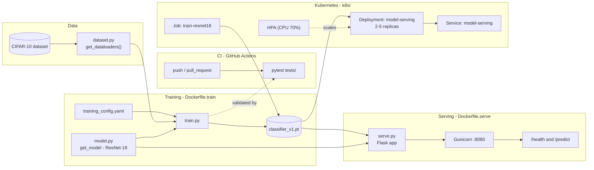

# mlops-pytorch-pipeline

Assignment 3 for MLOPS course — an end-to-end PyTorch training and serving pipeline for image classification on CIFAR-10, using a ResNet-18 backbone.

## Architecture



- **`src/dataset.py`** — builds train/val `DataLoader`s for CIFAR-10 with standard augmentation and normalization.
- **`src/model.py`** — constructs a ResNet-18 adapted for 32×32 inputs (3×3 stride-1 first conv, no initial max-pool).
- **`src/train.py`** — training loop with early stopping; reads `configs/training_config.yaml`, writes JSON logs, and saves the best checkpoint.
- **`src/serve.py`** — Flask inference service exposing `/health` and `/predict`, run under Gunicorn in the serving container.
- **`docker/Dockerfile.train`** / **`docker/Dockerfile.serve`** — separate images for training and serving.
- **`.github/workflows/ci.yml`** — installs dependencies and runs `pytest` on every push/PR to `main`/`develop`.
- **`k8s/`** — manifests to run training as a `Job` and serving as an autoscaled `Deployment` on Kubernetes.

## Project structure

```
mlops-pytorch-pipeline/
├── configs/
│   └── training_config.yaml   # model/training/data hyperparameters
├── docker/
│   ├── Dockerfile.train
│   └── Dockerfile.serve
├── k8s/
│   ├── namespace.yaml         # ml-training namespace
│   ├── configmap.yaml         # training_config.yaml as a ConfigMap
│   ├── training-job.yaml      # PVCs + training Job (GPU-schedulable)
│   ├── serving-deployment.yaml # model-serving Deployment (2 replicas, probes)
│   ├── serving-service.yaml    # ClusterIP Service for the serving pods
│   └── hpa.yaml                # HPA: 2-5 replicas on 70% CPU
├── requirements/
│   ├── train.txt
│   └── serve.txt
├── src/
│   ├── dataset.py
│   ├── model.py
│   ├── train.py
│   └── serve.py
└── tests/
    ├── conftest.py
    └── test_model.py
```

## Setup

### Prerequisites
- Python 3.11
- Docker, for containerized training/serving
- A Kubernetes cluster (e.g. Docker Desktop, minikube, kind) and `kubectl`, for the `k8s/` manifests

### Local environment

```bash
# from the repo root
python -m venv mlops_venv
mlops_venv\Scripts\activate          # Windows
# source mlops_venv/bin/activate     # macOS/Linux

pip install --upgrade pip
```

`requirements/train.txt` and `requirements/serve.txt` list `torch`/`torchvision` without pinning a build, so which PyTorch wheel you get depends on the index you install from:

**CPU only:**
```bash
pip install --extra-index-url https://download.pytorch.org/whl/cpu -r requirements/train.txt
```

**GPU (CUDA):**
```bash
pip install --extra-index-url https://download.pytorch.org/whl/cu121 -r requirements/train.txt
```
Pick the CUDA tag matching your driver (`cu121`, `cu124`, `cu128`, …) — see the [PyTorch install matrix](https://pytorch.org/get-started/locally/) for the current options. Then verify with:
```bash
python -c "import torch; print(torch.cuda.is_available())"
```

For running the API service instead, install `requirements/serve.txt` the same way (CPU or GPU index).

### Run the tests

```bash
pip install pytest
pytest tests/ -v
```

## Training

Training reads hyperparameters from [`configs/training_config.yaml`](configs/training_config.yaml) (architecture, epochs, batch size, learning rate, early stopping patience) and downloads CIFAR-10 automatically into `data/` on first run.

**Locally:**
```bash
python src/train.py
```

**With Docker:**
```bash
docker build -f docker/Dockerfile.train -t mlops-train .
docker run --rm -v "${PWD}/data:/app/data" -v "${PWD}/checkpoints:/app/checkpoints" mlops-train
```

`Dockerfile.train` installs `torch`/`torchvision` from plain PyPI, which ships a CUDA-enabled build — to actually use a GPU inside the container, run with the NVIDIA Container Toolkit installed on the host and add `--gpus all`:
```bash
docker run --rm --gpus all -v "${PWD}/data:/app/data" -v "${PWD}/checkpoints:/app/checkpoints" mlops-train
```
Without `--gpus all` (or on a host with no NVIDIA GPU/driver), training falls back to CPU automatically via `torch.cuda.is_available()` in [`src/train.py`](src/train.py).

Checkpoints are written to `checkpoints/classifier_v1.pt` (configurable via `output.checkpoint_dir` / `output.model_name`).

## Serving

The serving image loads the trained checkpoint and exposes a small Flask API behind Gunicorn.

**With Docker:**
```bash
docker build -f docker/Dockerfile.serve -t mlops-serve .
docker run --rm -p 8080:8080 -v "${PWD}/checkpoints:/app/checkpoints" mlops-serve
```

**Endpoints:**

| Method | Path       | Description                          |
|--------|------------|---------------------------------------|
| GET    | `/health`  | Returns service and model-load status |
| POST   | `/predict` | Accepts a multipart `image` file, returns per-class probabilities and the predicted class |

Example request:
```bash
curl -X POST -F "image=@test_image.png" http://localhost:8080/predict
```

## Kubernetes

[`k8s/`](k8s/) deploys the same training/serving images to a Kubernetes cluster instead of running them as standalone containers. All resources live in the `ml-training` namespace.

| File | Kind | Purpose |
|------|------|---------|
| [`namespace.yaml`](k8s/namespace.yaml) | `Namespace` | `ml-training` |
| [`configmap.yaml`](k8s/configmap.yaml) | `ConfigMap` | `training_config.yaml`, mounted into the training pod at `/app/configs` |
| [`training-job.yaml`](k8s/training-job.yaml) | `PersistentVolumeClaim` ×2, `Job` | `data-pvc` (2Gi) and `checkpoints-pvc` (500Mi), and a one-shot `train-resnet18` Job that runs to completion |
| [`serving-deployment.yaml`](k8s/serving-deployment.yaml) | `Deployment` | `model-serving`, 2 replicas, rolling updates, `/health` liveness/readiness probes, reads the checkpoint from `checkpoints-pvc` (read-only) |
| [`serving-service.yaml`](k8s/serving-service.yaml) | `Service` | `ClusterIP` exposing the Deployment on port 80 → container port 8080 |
| [`hpa.yaml`](k8s/hpa.yaml) | `HorizontalPodAutoscaler` | scales `model-serving` between 2 and 5 replicas at 70% average CPU utilization |

The training Job requests `nvidia.com/gpu: 1` and is pinned to nodes labeled `accelerator=nvidia-gpu` via `nodeSelector`/`tolerations` — see the comments in [`training-job.yaml`](k8s/training-job.yaml) for how to label a node, and for the WSL2 + Docker Desktop `libdxcore.so` workaround (not needed on a native Linux GPU node).

**Deploy:**
```bash
# build the images the manifests reference (imagePullPolicy: Never — no registry push needed
# for a local cluster like Docker Desktop; kind/minikube need an extra image-load step, see below)
docker build -f docker/Dockerfile.train -t mlops-train:v1 .
docker build -f docker/Dockerfile.serve -t mlops-serve:v1 .

# kind:      kind load docker-image mlops-train:v1 mlops-serve:v1
# minikube:  minikube image load mlops-train:v1 && minikube image load mlops-serve:v1

kubectl apply -f k8s/namespace.yaml
kubectl apply -f k8s/configmap.yaml
kubectl apply -f k8s/training-job.yaml
kubectl apply -f k8s/serving-deployment.yaml
kubectl apply -f k8s/serving-service.yaml
kubectl apply -f k8s/hpa.yaml
```

**Check status:**
```bash
kubectl get pods,jobs,deployments,hpa -n ml-training
kubectl logs -n ml-training job/train-resnet18
```

**Reach the service** (no Ingress is defined):
```bash
kubectl port-forward -n ml-training svc/model-serving 8080:80
curl -X POST -F "image=@test_image.png" http://localhost:8080/predict
```

Terminal output captured while running this on a GPU-enabled node is in [`terminal_outs/`](terminal_outs/).

## Continuous Integration

Every push and pull request to `main` or `develop` triggers [`.github/workflows/ci.yml`](.github/workflows/ci.yml), which installs dependencies and runs the `tests/` suite with `pytest`.
